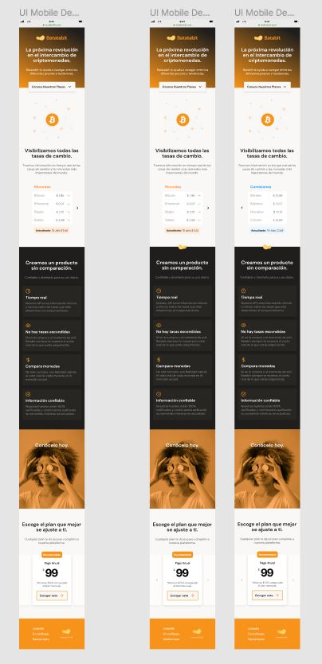

## Batata Bit Mobile Fist Project
---

*Autor: @axlze*

**Proyecto realizado durante el curso "Responsive Design: Maquetación Mobile First".**

## Descripción

Este sitio es la maquetación del prototipo mobil para el sitio Batata bit y tiene la finalidad de informar sobre los precios y tendencias de algunas criptomonedas.

## GitHub pages

Para visitar el sitio ingresa al siguiente link:

## Maqueta

Para el desarrollo de este proyecto nos basamos en la maqueta proporcionada por el curso.

## Features

- Uso de tecnologias web básicas `HTML` & `CSS`
- Uso de Git & GitHub desde consola git Bash
- Uso de GitHub Pages
- Uso de commits con mejor descripción
- Uso de elementos HTML y selectores en CSS
- Uso de Media Querys para lograr un diseño Responsivo
- Patrón de diseño `Mobile First`