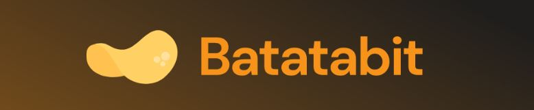
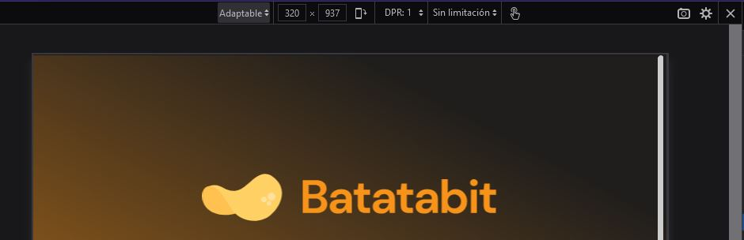
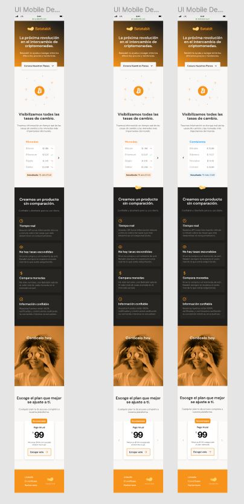

## Batata Bit Mobile Fist Project 🥔
---

*Autor: @axlze*

**Proyecto realizado durante el curso "Responsive Design: Maquetación Mobile First".**

## Descripción 🪙

Este sitio es la maquetación del prototipo mobil para el sitio Batata bit y tiene la finalidad de informar sobre los precios y tendencias de algunas criptomonedas.

### Atención ⚠

Para mejora la experiencia usa las herramientas de desarrollador en tu navegador de preferencia y usa la herramienta de diseño adaptativo (responsive design) para apreciar la pagina con tamaño mobile (320xn)

## GitHub pages 🌐

Para visitar el sitio ingresa al siguiente link:

[batata](https://axlgoze.github.io/Batata-Bit/)

## Maqueta 

Para el desarrollo de este proyecto nos basamos en la maqueta proporcionada por el curso.

## Features

- Uso de tecnologias web básicas `HTML` & `CSS`
- Uso de Git & GitHub desde consola git Bash
- Uso de GitHub Pages
- Uso de commits con mejor descripción
- Uso de elementos HTML y selectores en CSS
- Uso de `Media Querys` para lograr un diseño Responsivo
- Patrón de diseño `Mobile First`
- Uso de `LightHouse` para metrificar el producto